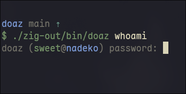

# doaz

a faithful Zig port of the `doas` privilege escalation tool

# TODO

- allow for rules
- parsing a config file
- allow running as users other than root
- create better testing and fuzzing

## Thanks to:

- [https://github.com/dmgk/zig-getopt](dmgk/zig-getopt) OBSD License
  for the getopt implementation
